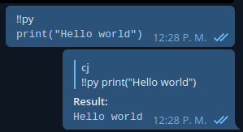
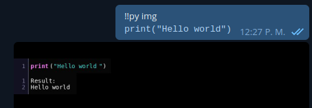

PyRun Userbot
=============

Userbot for telegram than runs Python code

Installation:
-------------

    pip install -U -r requirements.txt

You will also need to have ``imagemagick`` installed in your O.S.

If you get:

    pygments.formatters.img.FontNotFound: No usable fonts named:
    "Bitstream Vera Sans Mono"

You will need to add that font to your O.S. too.

Usage:
------

When you have your userbot runing, simply send python code in a message
using the command ``!!py``, for example:

    !!py
    print("Hello world")

and it would reply to your message with the result of running the code.

You can send the ``img`` parameter to the command if you want to have
a nice syntax highlighted image of the code, example:

    !!py img
    print("Hello world")

and you will get:

Warning:
--------

The bot creates a raw ``code.py`` file with the code you send to it in
your message, and runs it invoking the Python interpreter, so be careful
with the code you send, **don't wipe your system!**

ToDo:
-----

- Use ``pygments`` inside the code to avoid calling it with
  ``subprocess``.
